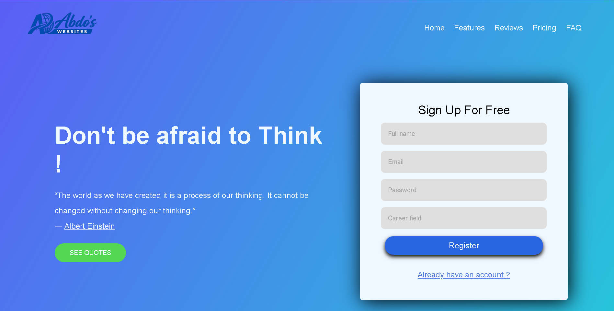
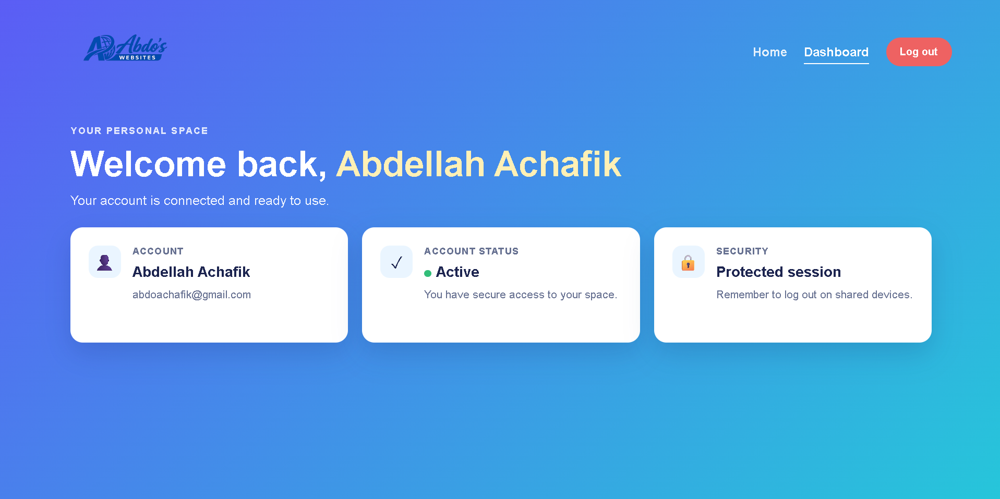
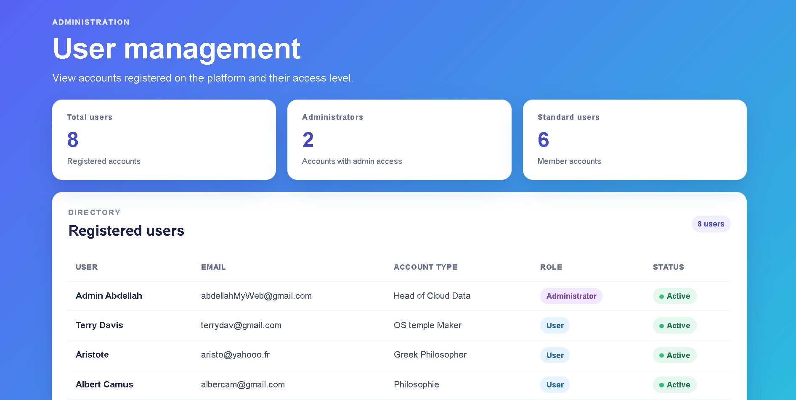

  

# Secure Authentication System

  
  
  
  
  

A web application developed with PHP and PostgreSQL featuring secure user authentication, session management, and role-based access control.
  

## Live Demo

🌐 <a href="https://my-website-production-bb28.up.railway.app" >
      My Website
    </a>

 

## Screenshots

### Home Page

  

Users can create an account, access the platform, and discover the application's features.

---

### User Dashboard

  

Authenticated users can access their personal dashboard and account information.

---

### Admin Dashboard

  

Administrators can manage users, view platform statistics, and monitor account status.

 

## Features

- User Registration
- Secure Login System
- Session Management
- Role-Based Access Control (User / Administrator)
- User Dashboard
- Admin Dashboard
- Form Validation
- Password Hashing
- PostgreSQL Database Integration

 

## Security Features

- Password hashing using `password_hash()`
- Password verification using `password_verify()`
- Session regeneration with `session_regenerate_id()`
- Input validation and sanitization
- Prepared SQL statements
- Secure authentication workflow

 

## Technologies

- PHP
- PostgreSQL
- HTML5
- CSS3
- Railway

 

## Project Goals

- Learn server-side web development with PHP
- Manage PostgreSQL databases
- Implement authentication systems
- Apply web security best practices
- Deploy a production-ready application

 

## Author

Abdellah Achafik
